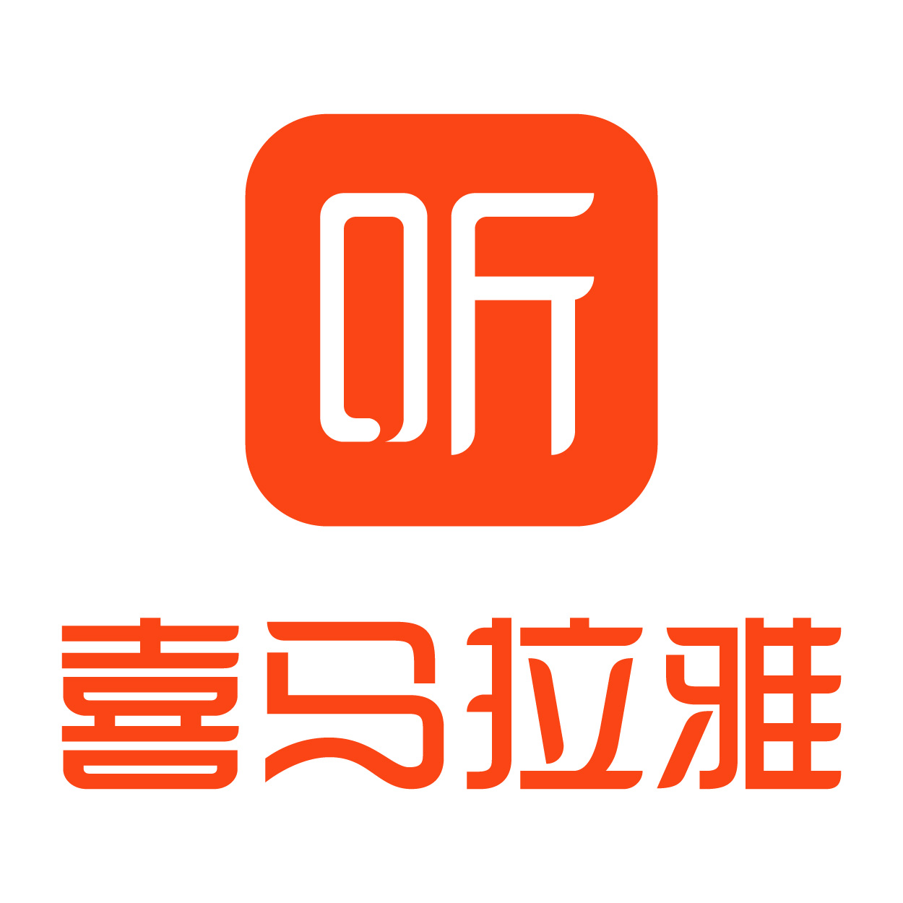

### Hi there 👋

    
    
    
    

欢迎关注我的微信公众号

<tr>
<td>

### 🏢 Work Experience

- [上海喜马拉雅](https://www.ximalaya.com/) &emsp; 📌 2023-05-09 —— 2023-08-08
  
  - 工作岗位：Web前端开发实习生
  - 工作内容：电商中台

</td>
</tr>

<tr><td>

<!--
**chenwll/chenwll** is a ✨ _special_ ✨ repository because its `README.md` (this file) appears on your GitHub profile.

Here are some ideas to get you started:

- 🔭 I’m currently working on ...
- 🌱 I’m currently learning ...
- 👯 I’m looking to collaborate on ...
- 🤔 I’m looking for help with ...
- 💬 Ask me about ...
- 📫 How to reach me: ...
- 😄 Pronouns: ...
- ⚡ Fun fact: ...
-->
